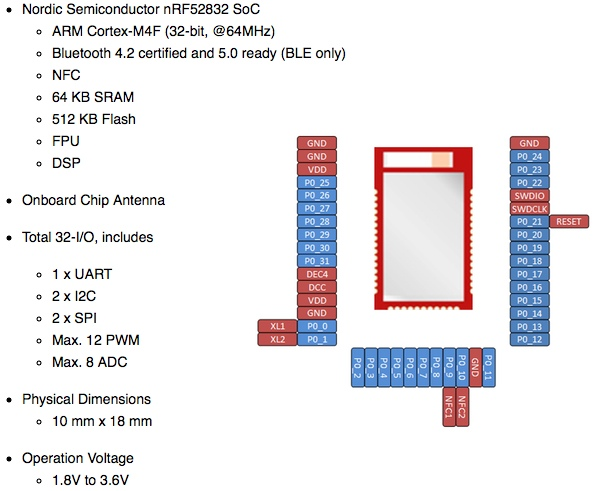
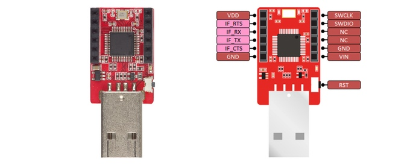
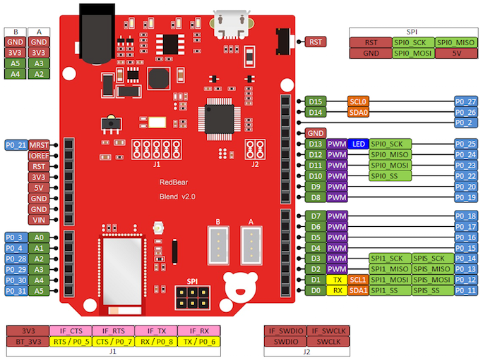

# nRF52-Beta

Thank you for supporting [RedBear nRF52832 Kickstarter](https://www.kickstarter.com/projects/redbearinc/bluetooth-5-ready-ble-module-nano-2-and-blend-2) campaign.

This private repository is for beta testing, you are invited to join this program and you will be able to try our new materials before we are going to release to the public.

## nRF52832

The nRF52832 BLE SoC combines its ARM processor with a 2.4GHz multiprotocol radio featuring -96 dB RX sensitivity, 512 kB Flash memory, 64 kB RAM and NFC-A tag for “Touch-to-Pair” capability. You can read all [nRF52832 advanced features](https://www.nordicsemi.com/eng/Products/Bluetooth-low-energy/nRF52832) on Nordic's website.

### nRF52 vs nRF51

The nRF51822 runs at 16 MHz only, it is only a Cortex-M0 MCU without DSP and FPU for complicated applications. You will not be able to develop Apple HomeKit projects using nRF51.

## BLE Module (MB-N2)

At the heart of all the new products is our new BLE Module model# MB-N2. It houses the Nordic nRF52832, an on-board antenna and other components special tuning for great performance and low power consumption.

The module provides all GPIO pins and supports all advance features offer by Nordic nRF52832.

With your support, we have our module certified for CE, FCC and Bluetooth. If you use this module for your own products, not only you have the assurance, you will also save some cost on your own product certifications.

Bluetooth QDID: [91904](https://www.bluetooth.org/tpg/QLI_viewQDL.cfm?qid=33543)

If you have some great project ideas, please refer to the [datasheet](./datasheet/MB-N2 Datasheet.pdf) of the module MB-N2 for details.

## BLE Nano 2

We launched our first BLE Nano in 2014 and it is our most popular product. We design Nano 2 as a ‘drop-in’ replacement, with exactly the same form factor, and in most instances only need to change few firmware code. In addition, the new development board also offers a U.FL connector for an external NFC antenna, while users will benefit from the extra processing power and hardware resources of the nRF52832 SoC.

### DAPLink

This board has an ARM Cortex-M3 MCU and is used to program and debug an application running on Nano 2 via SWD. DAPLink is an open source project by ARM mbed team, more about [DAPLink](https://developer.mbed.org/handbook/DAPLink).

### Proto Board

We design this new Proto Board for you to get started easily. You can power your Nano via coin cell battery, rechargeable battery or USB. The top part could be removed if you don't need it. It has 3 connectors for Seeed's Grove modules (more details below). Last but not least, we have reserved a place for the Apple MFi authentication coprocessor; you can develop BLE HomeKit product if you have the MFi license. 

## Blend 2

Our Blend is very popular as it is a "full-size" Arduino compatible board which supports most shields. It has on board a Cortex-M3 MCU that supports DAPLink, slot for Apple MFi coprocessor and two Grove connectors.

You should choose the Blend 2 if you want to test all GPIOs and functions available on the Nordic nRF52832 SoC. 

## Getting Started

Before starting to use the nRF52832 boards, you need to do some preparations.

* [Out-of-Box Test](https://github.com/redbear/nRF52-Beta/blob/master/docs/Getting_Started_Guide.md) will guide you to test the nRF52 board.
  
* [Updating the DAPLink interface firmware](https://github.com/redbear/nRF52-Beta/tree/master/daplink "firmware") to the latest version, otherwise, you may have problem for drag-n-drop programming the nRF52 SoC.

* [Installing nRF52832 board package](https://github.com/redbear/nRF52-Beta/blob/master/docs/Arduino_Board_Package_Installation_Guide.md) for using the Arduino IDE for development your projects.

## Technical Support

* If you think you have a **faulty unit**, kindly [open a support ticket](https://redbear.freshdesk.com/) and the support team will follow up with you.

* For software issues, please submit in this repository.

* [Nordic Forum](https://devzone.nordicsemi.com/questions/)

* [RedBear Discuss Forum](discuss.redbear.cc)

## Resoureces

* [Documentations](./docs)
	* [Product Specifications](./docs/Specifications.md)
	* [Getting Started Guide](./docs/Getting_Started_Guide.md)
* [Nordic nRF52832 Product Specification](http://infocenter.nordicsemi.com/index.jsp?topic=%2Fcom.nordic.infocenter.nrf52%2Fdita%2Fnrf52%2Fchips%2Fnrf52832_ps.html)
* [MB-N2 Datasheet](./datasheet/MB-N2 Datasheet.pdf)
* [PCB Files](./pcb)

