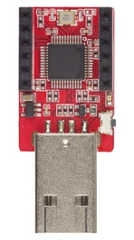

#DAPLink User Guider
***

###Features

* ARM 32bit Cortex-M3
* 128KB FLASH, 20KB RAM
* VIN support 3v3 ~ 5v input
* VDD output 3v3
* MSC - drag-n-drop programming flash memory
* CDC - virtual com port for log, trace and terminal emulation
* HID - CMSIS-DAP compliant debug channel
* Support targets:
	- BLE Nano (nRF51822)
	- BLE Nano2 (nRF52832)

###Pinouts

###Driver installing(Just windows)

Please refer to this [https://developer.mbed.org/handbook/Windows-serial-configuration](https://developer.mbed.org/handbook/Windows-serial-configuration "DAPLink_Windows_Driver")

After installing driver, will see:

###Update interface firmware

Pressing button and connecting to PC, the driver ***"MAINTENANCE"*** will appeare.Drag the interface firmware(.bin file) into the driver, re-connected to PC.

The firmware Linker:

 * For BLE Nano : [https://github.com/redbear/nRF5x/tree/master/nRF51](https://github.com/redbear/nRF5x/tree/master/nRF51 "interface firmware")

 * For BLE Nano2.0 : [https://github.com/redbear/nRF5x/tree/master/nRF52](https://github.com/redbear/nRF5x/tree/master/nRF52 "interface firmware")

###Using DAPLink on Keil5 IDE

Open the Options, select ***"CMSIS-DAP Debugger"***.

Select ***"SW"*** interface, 

Change the size of ***"RAM for Algorithm"*** and add ***"Programming Algorithm"***.

Clink OK, then you could use Keil5 to upload and debug.

#####FAQ

 * Flash download failed - "Cortex-M4"
    
    When the nRF52 has softdevice, downloading the application will happen this problem.
	

    You need to eraseall the nRF52 flash.Drag the nRF52832_EraseChip.hex to the driver(DAPLink) to erase chip.Then you can download application through Keil5 IDE.
    
    [Linker : nRF52832_EraseChip.hex](https://github.com/redbear/nRF5x/tree/master/nRF52/test_firmware)

###More Information

 * [https://github.com/mbedmicro/DAPLink](https://github.com/mbedmicro/DAPLink "mbed-DAPLink")
