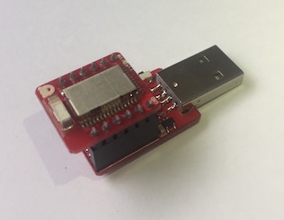

# Getting Started Guide

## Out-of-Box Test

To test the board for the first time, follow these steps:

* The preloaded firmware is a BLE Heart Rate peripheral simulator.
* To test the BLE Nano 2 or Blend 2 boards
	* BLE Nano 2
		* 
		* Stack the BLE Nano 2 on the DAPLink USB dongle
	* Blend 2	
		* Connect it to your 5V USB adaptor or PC USB port using an USB **DATA** cable.
		* Note: Some USB cables are for charging only, no data lines inside.
* You will see the onboard LED is flashing.
* Use Nordic's iOS or Android Apps, nRFToolBox and use the HRM icon to connect to the board, the Heart Rate counter will be increasing every 1 second.
* Congrats, your board works as expected.

## Arduino

* Follow the [Arduino Installation Guide](./Arduino_Board_Package_Installation_Guide.md).

## Nordic SDK

- To be written -

## mbed

- To be written -

